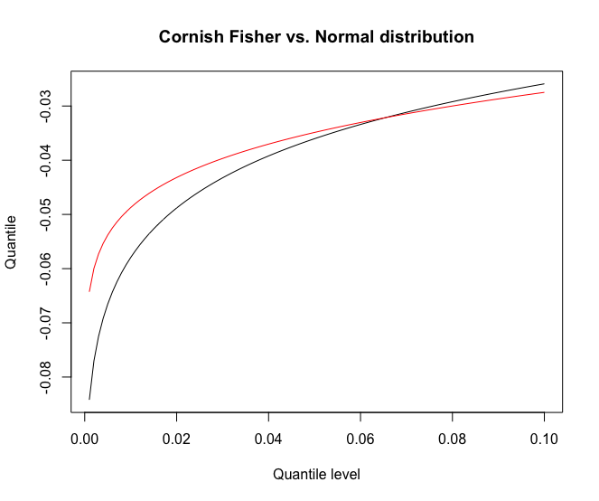

[](http://quantlet.de/)

## [](http://quantlet.de/) **XFG_Cornish_Fisher** [](http://quantlet.de/)

```yaml

Name of QuantLet : XFG_Cornish_Fisher

Published in : 'XFG'

Description : 'Function for calculating the Cornish Fisher approximation for given quantile levels. Plots the extreme quantiles of the CF approximation vs. quantiles of the normal distribution.'

Keywords : VaR, Cornish Fisher, Value at risk

See also : 'XFG_VaR_ES, XFGcofi, SPL_VAR_CVAR_Calculation'

Author : Georg Keilbar

Submitted : April 28 2019 by Georg Keilbar

```



### R Code
```r

#Set working directory
setwd("~/Desktop/IRTG/Teaching/R")

#Read in data
data = read.csv("DBK.DE.csv")

#Generate daily log returns
x = diff(log(as.numeric(data$Close)),lag=1)

#Function for Cornish Fisher approximation
CF = function(z,tau){

  #Standardize (mean 0, variance 1)
y = (z-mean(z))/sd(z)

#Calculate the first 5 moments
mu1 = mean(y)
mu2 = mean(y^2)
mu3 = mean(y^3)
mu4 = mean(y^4)
mu5 = mean(y^5)

#Calculate the 5 cumulants
k1 = mu1
k2 = mu2
k3 = mu3
k4 = mu4 - 3*mu2^2
k5 = mu5 - 10*mu3*mu2

#Cornish Fisher approximation of the tau-quantile of y
y_tau = qnorm(tau) + (qnorm(tau)-1)*k3/6 + (qnorm(tau)^3-3*qnorm(tau))*k4/24 - (2*qnorm(tau)^3-5*qnorm(tau))*k3^2/36 +
  (qnorm(tau)^4-6*qnorm(tau)^2+3)*k5/120 - (qnorm(tau)^4-5*qnorm(tau)^2+2)*k3*k4/24 + (12*qnorm(tau)^4-53*qnorm(tau)^2+17)*k3^3/324

#Transform back
z_tau = y_tau * sd(z) + mean(z)
return(z_tau)
}

#Sequence of quantile levels
q = seq (0.001,0.1,0.001)

#Calculate CF and Normal quantiles for the sequence
CF_app = sapply(q,CF,z=x)
Normal = sapply(q,qnorm,mean=mean(x),sd=sd(x))

#Plot the results
plot(CF_app~q,type="l",xlab="Quantile level",ylab="Quantile",main="Cornish Fisher vs. Normal distribution")
lines(Normal~q,col="red")
```

automatically created on 2019-04-29